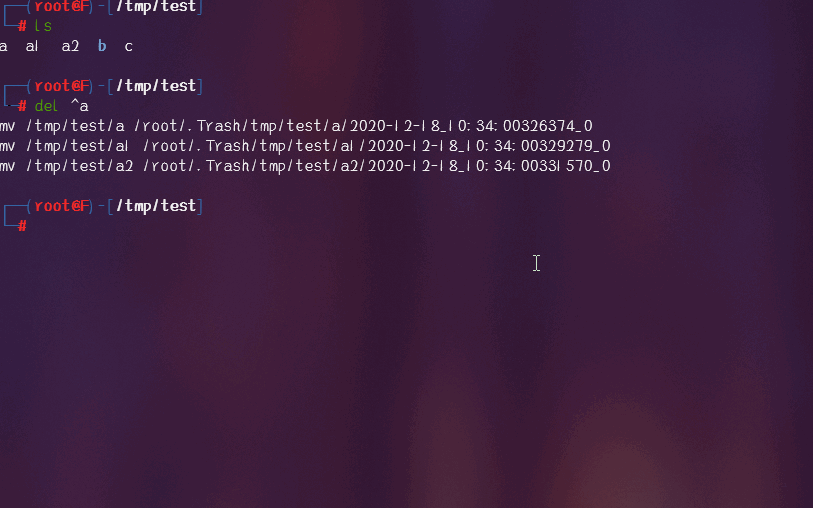

# Recycle
> recycle for linux

## Screenshot



## Usage
- del file: `del file_path`
- undel file: `undel file_path` or `undel trash_path`
- permanently delete file: `pdel trash_file`
- trash tree: `tt`
- trash tree with `less`: `tl`
- example
    - `del ~/a`, `del /root/a`, `del a`, `del \^a`, `del "^a"`
    - `undel ~/a`, `undel /root/a`, `undel a`, `undel ~/.Trash/root/a`
    - `pdel ~/a`, `pdel /root/a`, `pdel a`, `pdel ~/.Trash/root/a`
    - `tt`, `tt ~`
    - `tl`, `tl ~`

## Installation
1. `pip install py-recycle`
2. `/usr/local/bin/recycle_init 2&> /dev/null || ~/.local/bin/recycle_init`

## Configuration

`vim ~/.py_recycle.json`

```Json
{
    "TRASH_PATH": "/root/.Trash",
    "ENABLE_EMOJI": true
}   
```
### Emoji

> Enable when setting `ENABLE_EMOJI` to true, default is true.

```
/root/.Trash/root/git/recycle/Test
├── 📁 2021-02-18_14:52:05620877_4.0K
├── a
│   ├── 📁 2021-02-18_14:51:50932229_4.0K
│   └── 📄 2021-02-18_14:52:01623779_0
├── b
│   ├── 📁 2021-02-18_14:51:50934404_4.0K
│   └── 📄 2021-02-18_14:52:01626129_0
└── c
    ├── 📁 2021-02-18_14:51:50945546_4.0K
    └── 📄 2021-02-18_14:52:01636655_0
```
